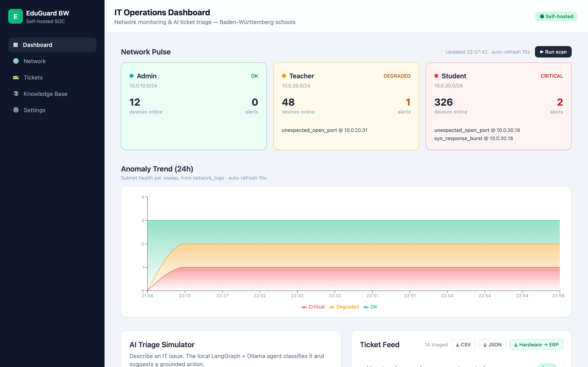
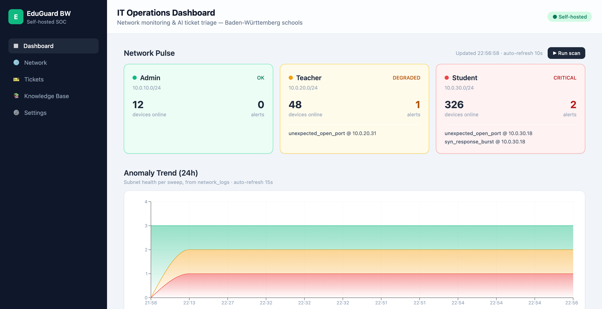
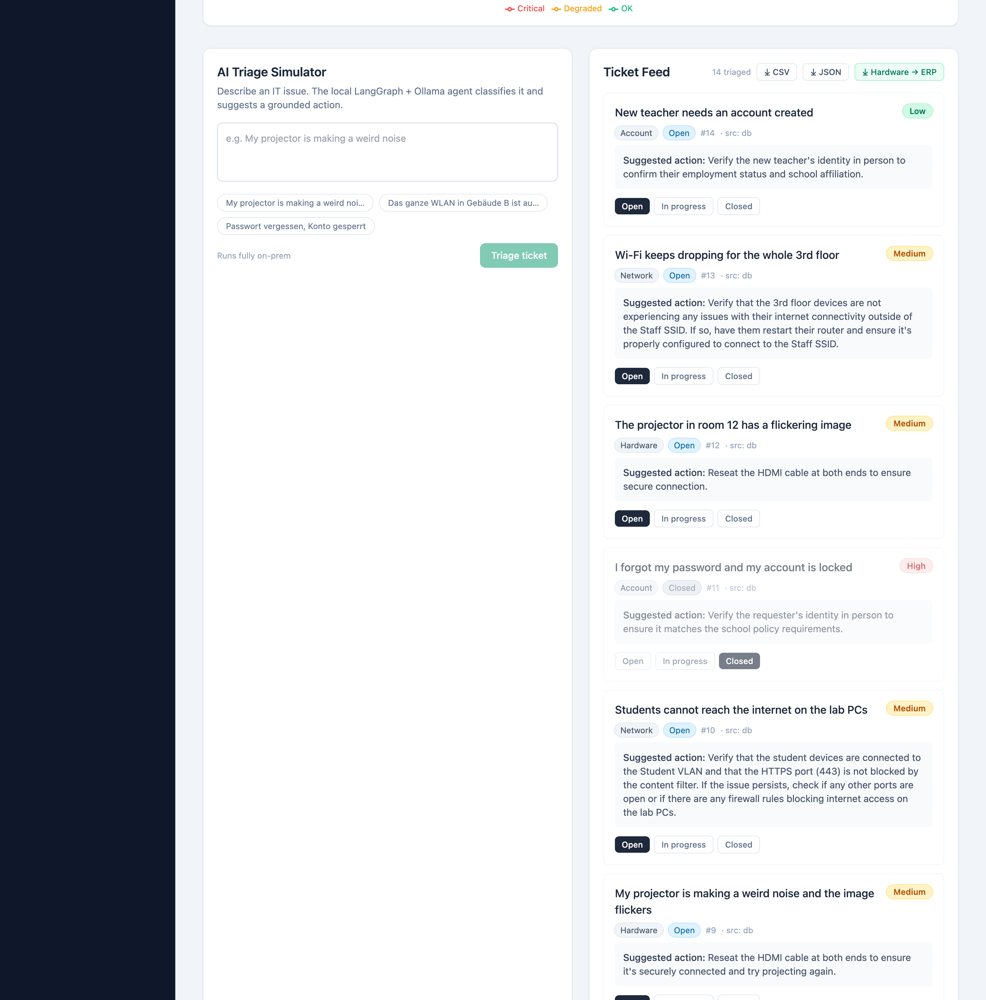
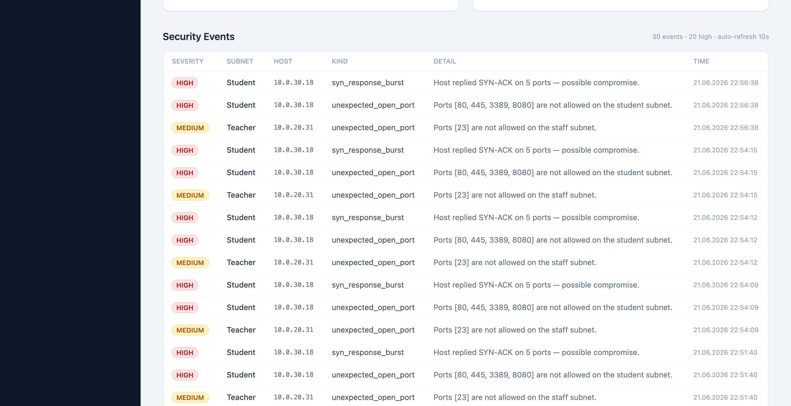

# EduGuard BW

[](https://github.com/haydarkozat/eduguard-bw/actions/workflows/ci.yml)
[](LICENSE)
[](https://www.python.org/)
[](https://fastapi.tiangolo.com/)
[](https://nextjs.org/)
[](https://www.docker.com/)
[](#-self-hosting--gdpr)

> **GDPR-compliant, fully self-hosted School IT Network Monitoring & AI Triage** — a mini-SOC for schools in Baden-Württemberg. Network logs, IT tickets, and LLM inference all stay on-premises. **No data ever leaves the network.**



---

## ✨ What it does

| Capability | How |
|---|---|
| **Lightweight NIDS** | Async Scapy ARP + SYN sweeps across Admin / Teacher / Student subnets with role-based anomaly detection |
| **AI Ticket Triage** | LangGraph (`analyze → suggest`) over a **local Ollama** model — classifies category & priority, no external calls |
| **RAG-grounded answers** | Qdrant vector search injects local IT documentation into the prompt so suggestions are factual |
| **Proactive monitoring** | 24h anomaly trend chart (Recharts) from persisted scan history |
| **Enterprise-ready** | CSV / JSON export with SAP S/4HANA-friendly field mapping |
| **Privacy by design** | Everything containerized & self-hosted — Ollama, Qdrant, PostgreSQL all run locally |

---

## 📸 Screenshots

### Network monitoring & anomaly trend
Live subnet health cards (🟢 OK · 🟡 degraded · 🔴 critical) + a 24-hour stacked anomaly timeline.



### AI triage & ticket feed
Describe an issue → local LangGraph + Ollama classifies it, RAG grounds the action. Tickets are persisted with workflow status and an ERP export.



### Security events (NIDS audit trail)
Every detected anomaly is persisted — a NIS2-style audit log.



---

## 🏗️ Architecture

```
eduguard-bw/
├── backend/                 FastAPI · Scapy NIDS · LangGraph + Ollama · Qdrant RAG · SQLAlchemy
│   ├── main.py              API surface (network, nids, support, security, export)
│   ├── network_scanner.py   async Scapy ARP/SYN sweep + anomaly heuristics
│   ├── ai_triage.py         LangGraph state graph (analyze → suggest)
│   ├── knowledge_base.py    KB interface: mock ⇄ Qdrant (swappable)
│   ├── rag_engine.py        Qdrant collection + local embeddings (Ollama / hash fallback)
│   ├── database.py          SQLAlchemy engine + session
│   └── models.py            NetworkLog · SecurityEvent · SupportTicket
├── frontend/                Next.js (App Router) + Tailwind + Recharts
│   └── app/components/       NetworkPulse · NetworkTrendChart · TriageSection · SecurityEvents
└── infrastructure/
    └── docker-compose.yml   postgres · qdrant · ollama · backend · frontend
```

### Tech stack
- **Backend:** Python 3.11, FastAPI, SQLAlchemy
- **Network analysis:** Scapy (async via thread offload)
- **AI:** LangGraph + local **Ollama** (`llama3` / `llama3.2`), grounded with RAG
- **Data:** PostgreSQL (logs, tickets) · Qdrant (vector KB, `nomic-embed-text`)
- **Frontend:** Next.js App Router, Tailwind CSS, Recharts
- **Infra:** Docker Compose — fully self-hosted

---

## 🔌 API

| Method | Endpoint | Purpose |
|---|---|---|
| `GET`  | `/api/network/status` | Live subnet health |
| `GET`  | `/api/network/history?hours=24` | Trend time series |
| `POST` | `/api/nids/scan` | Trigger async Scapy sweep |
| `GET`  | `/api/nids/scan/{id}` | Poll a scan job |
| `POST` | `/api/support/triage` | LangGraph + Ollama triage |
| `GET`  | `/api/support/tickets` | List tickets (filterable) |
| `PATCH`| `/api/support/tickets/{id}` | Update ticket status |
| `GET`  | `/api/security/events` | NIDS anomaly log |
| `GET`  | `/api/export/tickets?format=csv\|json` | ERP-ready export |

Interactive docs at `http://localhost:8000/docs`.

---

## 🚀 Quick start

```bash
cd infrastructure
cp .env.example .env            # adjust secrets / host ports if needed
docker compose up --build

# pull the local models once Ollama is up:
docker exec -it eduguard-ollama ollama pull llama3.2          # chat (lightweight, ~2GB)
docker exec -it eduguard-ollama ollama pull nomic-embed-text  # embeddings (~270MB)
```

Then open the dashboard:

| Service | URL |
|---|---|
| **Dashboard** | http://localhost:3000 |
| **API docs** | http://localhost:8000/docs |
| Qdrant | http://localhost:6333 |

> **Resilient by design:** before the models are pulled, triage falls back to a keyword heuristic and RAG to a deterministic hash embedding — the whole stack works end-to-end either way. With raw-socket capability the NIDS runs live Scapy sweeps; otherwise set `EDUGUARD_SIMULATE=1` for mock anomalies.

---

## 🔒 Self-hosting & GDPR

EduGuard BW is built for **data sovereignty**: the LLM (Ollama), the vector store (Qdrant), and the database (PostgreSQL) all run inside your own Docker network. No ticket text, network log, or query is ever sent to a third-party API. This makes it suitable for the strict data-protection requirements of public-sector education in Germany (DSGVO / NIS2).

---

*Prototype — built as a portfolio demonstration of a sovereign, AI-assisted school IT operations platform.*
